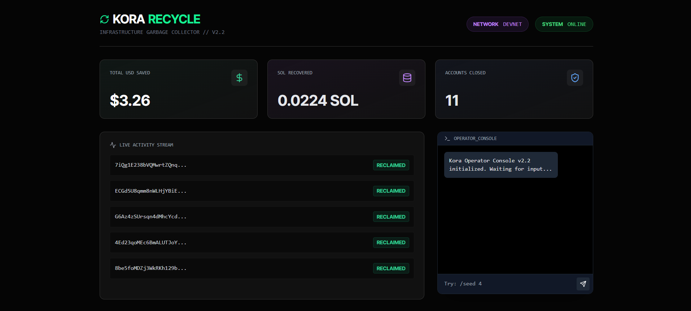
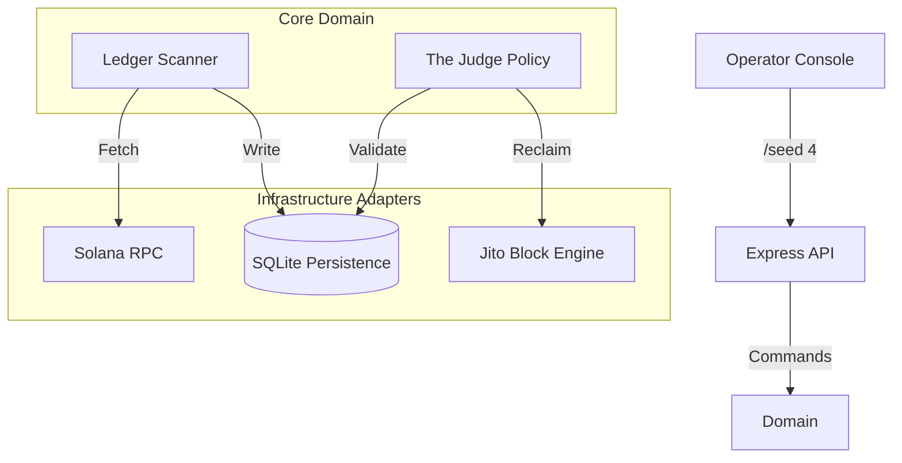

# ♻️ Kora-Recycle
> **The Garbage Collector for Solana Infrastructure**



**Kora-Recycle** is an automated infrastructure sidecar that reclaims lost SOL from dormant accounts for Kora Node operators. Powered by **Jito Bundles**, **Hexagonal Architecture**, and a real-time **Command Console**.

---

## 📉 The Problem
Running a Solana Node involves managing thousands of user accounts. When users abandon sessions or ephemeral sub-accounts ("dust"), they leave behind Rent-Exempt SOL (approx. 0.002 SOL per account).
* **The Cost:** 1,000 dormant accounts = ~2 SOL locked forever.
* **The Risk:** Manually closing accounts is dangerous (accidental user deletion) and slow.

## 🛡️ The Solution
Kora-Recycle is a "set-and-forget" backend service that acts as a localized Garbage Collector.
1.  **Snoops** the ledger for dormant accounts.
2.  **Judges** them against strict safety policies (Zero-Knowledge proof of emptiness).
3.  **Reaps** them using **Atomic Jito Bundles**, returning the rent deposit directly to the operator's wallet.

---

## 🏗️ Architecture
This project is built using **Hexagonal Architecture (Ports & Adapters)** to ensure domain logic is isolated from the blockchain layer.


---

## 🛠️ Tech Stack
* **Backend:** TypeScript, Node.js, Express, SQLite, Better-SQLite3.
* **Blockchain:** Solana Web3.js, Jito SDK (MEV Bundles).
* **Frontend:** React, Vite, TailwindCSS, Framer Motion.

---

## 🚀 Getting Started (For Judges)

### Prerequisites
* Node.js (v18+)
* npm or yarn
* A Solana Wallet (Private Key) for the Operator.

### 1. Backend Setup (The Infrastructure)
The backend handles the scanning, database management, and Jito bundling.
```bash
# Clone the repo
git clone https://github.com/fourthe3rd/kora-recycle.git
cd kora-recycle

# Install dependencies
npm install

# Configure Environment
# Copy the example file and add your keys
cp .env.example .env
```

Update `.env` with your keys:
```ini
SOLANA_RPC_URL=https://api.devnet.solana.com
KORA_FEE_PAYER=Your_Public_Key
KORA_OPERATOR_KEY=Your_Private_Key_Base58_String
```

### 2. Frontend Setup (The Command Center)
The dashboard provides real-time visualization and control.
```bash
# Open a new terminal
cd kora-dashboard

# Install dependencies
npm install

# Start the UI
npm run dev
```

---

## 🎮 Usage Guide

### Step 1: Start the Backend
```bash
# From the root directory
npx ts-node src/cmd/server/main.ts
```

You should see: `📡 Kora Command Uplink: http://localhost:3001`

### Step 2: Open the Dashboard
Go to `http://localhost:5173` in your browser. You will see the **Live Activity Stream** and **Financial Metrics**.

### Step 3: Run a Simulation (The Magic)
Kora-Recycle includes a simulation engine to demonstrate the garbage collection process without waiting for organic user churn.

In the Dashboard Terminal (bottom right), type:
```bash
/seed 4
```

* **Watch:** The system will generate 4 "trash" accounts on Devnet.
* **Wait:** Within 10-20 seconds, the Snooper will detect them.
* **Profit:** The Reaper will bundle them via Jito, and your **Total Saved** counter will increase.

---

## 🧪 Key Components

### 🕵️ The Snooper (Scanner)
Runs on a configurable interval (default: 10s). It scans the cursor position on the ledger to find accounts created by the operator that have no active session tokens.

### ⚖️ The Judge (Policy Engine)
Enforces the "Safety First" rule. An account is only marked `SAFE_TO_REAP` if:

* It is owned by the specific Program ID.
* It has 0 active lamports (excluding rent).
* It has been dormant for > X blocks.

### 💀 The Reaper (Jito Integration)
Constructs an atomic transaction bundle:

* **Instruction 1..N:** Close Account (Transfer rent to Operator).
* **Instruction N+1:** Jito Tip (Payment to validator).

This ensures that either **ALL** accounts are reclaimed, or **NONE** are, preventing partial failures and wasted gas.

---

## 🏆 Hackathon Notes
* **Jito Integration:** Located in `src/internal/infrastructure/jito`
* **Safety Logic:** Located in `src/internal/domain/services/judge.ts`
* **Simulation:** The `/seed` command is handled by `trash_service.ts`